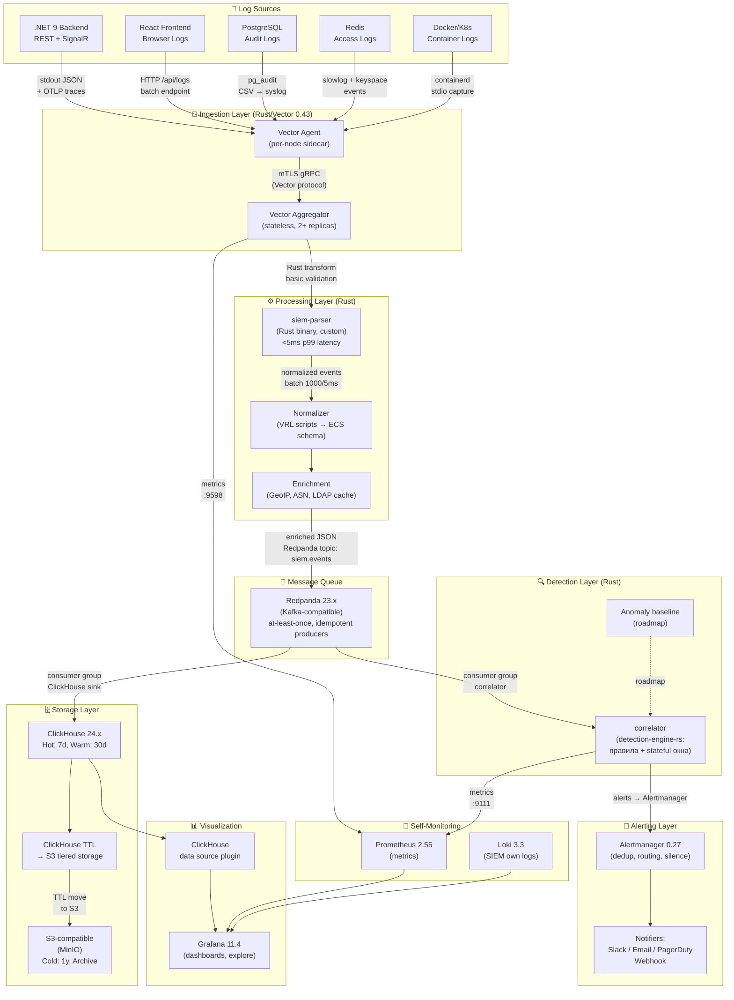

# SIEM-Lite: Архитектура и потоки данных

Указатель документации: [`README.md`](README.md).

## 1. Общая архитектура

## 2. Роли каждого слоя

### Ingestion Layer (Vector 0.43, Rust)
- **Vector Agent** — sidecar на каждой ноде. Читает stdout/stderr контейнеров, системные логи, syslog. Минимальная трансформация (добавление `host`, `container_name`). Буферизует на диск при потере связи с аггрегатором.
- **Vector Aggregator** — stateless, 2+ реплик за L4 балансировщиком. Принимает по Vector protocol (gRPC + mTLS), применяет VRL-трансформации первого уровня (routing по типу источника), передаёт в Rust-парсер по Unix socket или localhost gRPC.

**Почему Rust/Vector**: нативный Rust, zero-copy буферизация, встроенный VRL для трансформаций, 10k+ EPS на одном ядре documented benchmarks.

### Processing Layer (Rust binary: siem-parser)
- Принимает сырые байты, определяет формат (JSON/CEF/syslog/plain), парсит, нормализует в ECS-совместимую схему.
- Применяет PII-маскирование через regex-automata (детерминированный DFA, zero allocation на горячем пути).
- Обогащение: GeoIP (MaxMind MMDB, mmap), ASN lookup, внутренний LRU-кэш LDAP-пользователей (TTL 5 мин).
- **Целевые метрики**: <5ms p99 на parsing+normalization+enrichment для 1KB события, 10k EPS на одном ядре CPU.

### Message Queue (Redpanda 23.x)
- Kafka-совместимый, написан на C++, без JVM overhead.
- Topic `siem.events` — партиций 12, replication factor 3 (prod) / 1 (dev).
- Producers: idempotent (`enable.idempotence=true`), `acks=all` — гарантия at-least-once.
- Consumers: ClickHouse sink читает батчами, использует offset commit после успешной вставки.

### Storage Layer (ClickHouse 24.x)
- Основная таблица `siem.events` с движком `MergeTree`, партиционирование по `toYYYYMMDD(timestamp)`.
- TTL: hot 7d на NVMe → warm 30d на HDD → cold через S3 tiered storage (MinIO).
- Дедупликация через `ReplacingMergeTree` для событий с одинаковым `event_id`.
- Материализованные представления для агрегатов: топ IP, топ users, rate counters.

### Detection Layer (Rust)
- **correlator** (крейт **detection-engine-rs**) — единый consumer `siem.events` в Docker Compose и в `deploy/k8s`: stateless-правила и stateful окна (brute-force, rate limit и т.д.) в одном процессе, состояние в Redis с TTL. Логика согласована с YAML в `sigma-rules/` (без загрузки Sigma в рантайме). Отдельный бинарь `detector` не поднимается, чтобы не дублировать consumer и Redis-счётчики.
- Детекция латентность: <500ms от события до генерации алерта (критические правила).

### Alerting Layer (Alertmanager 0.27)
- Роутинг по severity: `critical` → PagerDuty + Slack, `high` → Slack + email, `medium/low` → email.
- Группировка по `source_ip` + `rule_id`, cooldown 5 мин, повторный алерт через 30 мин.
- Silence API для planned maintenance.

### Visualization (Grafana 11.4)
- ClickHouse datasource plugin (Altinity).
- Dashboards: Overview (EPS, top threats), Incident timeline, User activity, Infrastructure health.
- Explore mode для ad-hoc SQL-запросов к ClickHouse.

## 3. Гарантии доставки

| Участок | Гарантия | Механизм |
|---------|----------|-----------|
| Source → Vector Agent | best-effort | file position tracking, socket reconnect |
| Agent → Aggregator | at-least-once | Vector disk buffer, retry with backoff |
| Aggregator → Redpanda | at-least-once | idempotent producer, acks=all |
| Redpanda → ClickHouse | at-least-once | offset commit after INSERT |
| Redpanda → Detection | at-least-once | consumer group, manual offset commit |
| Detection → Alertmanager | at-least-once | HTTP retry, dedup по fingerprint |

**Exactly-once** не реализовано на всём пути намеренно — это упрощает архитектуру. Дедупликация на уровне ClickHouse (`ReplacingMergeTree` по `event_id`) обеспечивает идемпотентность хранения.

## 4. Rust-компоненты: где и почему

| Компонент | Технология | Обоснование |
|-----------|-----------|-------------|
| Vector Agent/Aggregator | Vector 0.43 (Rust) | Доказанная производительность, встроенный VRL, native async |
| siem-parser | Rust binary | <5ms SLA невозможен на JVM/GC-языках при p99 гарантиях |
| PII masking | regex-automata crate | DFA без backtracking, zero-alloc на горячем пути |
| GeoIP enrichment | maxminddb crate + mmap | Нулевые аллокации при lookup, mmap shared между потоками |
| Protocol buffers | prost crate | Protobuf там, где включено в крейтах (зависимость siem-parser и др.) |

## 5. Сервисы вокруг контура (продукт)

Дополнительно к блокам на диаграмме §1:

| Компонент | Назначение |
|-----------|------------|
| **PostgreSQL** | БД `soc_cases` для **case-management-rs** (кейсы, расследования). |
| **Redis** | Состояние sliding windows и счётчиков для **correlator** (detection-engine-rs). |
| **case-management-rs** | HTTP API кейсов; остаётся отдельным сервисом для lifecycle/timeline/investigation данных. |
| **siem-portal** | Единый analyst-facing **Unified Suite** (Rust): web app + BFF к Prometheus, Alertmanager, correlator, case-management и read-only event search поверх ClickHouse — см. [`SIEM_PORTAL.md`](SIEM_PORTAL.md). |
| **siem-desktop** | Tauri десктоп-приложение: WebView над Unified Suite, замена egui-based siem-operator. |
| **siem-admin** | Профиль Compose `admin`: операции со стеком, сиды ClickHouse (Docker socket на хосте). |
| **log-generator** / **siem-stress** | Синтетические события в Vector для метрик и проверки детекции. |
| **intel-connector** | Профиль Compose `intel`: MISP / HTTP JSON / файл → `threat_intel` + опционально Redis для матча в парсере. См. [`INTEL_CONNECTOR.md`](INTEL_CONNECTOR.md). |

**Мониторимое приложение** в архитектуре (типично **.NET 9 + React**) в репозитории **siem-lite не обязано присутствовать** — это целевой источник логов; SIEM принимает данные через Vector, HTTP ingest и другие настроенные источники.

**Языки в репозитории:** основной код платформы — **Rust**; UI кейсов — **TypeScript/React**; тесты и сиды — **Python** (см. `tests/`, `scripts/seed-data/`).
